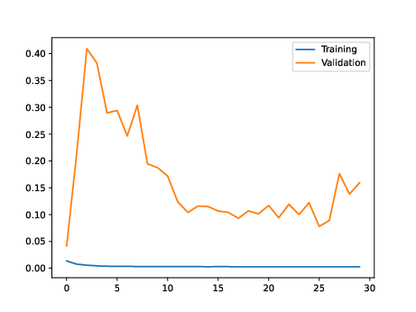
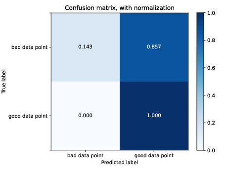

# wlai-uf-hackathon-2023

## Overview

Machine learning code for quality control of water level data from measurement stations.

## Contact

For additional information, contact:

- Lindsay Abrams,
- NOAA Center for Operational Oceanographic Products and Services,
- lindsay.abrams@noaa.gov

## Tutorial

### Download data

1) Install `gdown` to download from Google Drive
<!-- end of the list -->

    pip install gdown

2) Download all 5 data archives 
<!-- end of the list -->

    # This does not work because of the share link permissions! 
    sh download_data.sh

### Setup Python environment 

1) [Install Anaconda using their documentation](https://docs.anaconda.com/free/anaconda/install/linux/)

2) Create Anaconda environment
<!-- end of the list -->

    conda create --name=tf python=3.9
    conda activate tf
    conda install -c conda-forge cudatoolkit=11.2.2 cudnn=8.1.0

    mkdir -p $CONDA_PREFIX/etc/conda/activate.d
    echo 'export LD_LIBRARY_PATH=$LD_LIBRARY_PATH:$CONDA_PREFIX/lib/' > $CONDA_PREFIX/etc/conda/activate.d/env_vars.sh

    python3 -m pip install tensorflow==2.10
    python3 -m pip install pandas matplotlib imbalanced-learn

    # Verify install
    python3 -c "import os; os.environ['TF_CPP_MIN_LOG_LEVEL'] = '3'; import tensorflow as tf; print('Num GPUs Available: ', len(tf.config.list_physical_devices('GPU')))"

3) Activate Anaconda environment (whenever you start working)
<!-- end of the list-->

    conda activate tf

4) Deactive Anaconda environment (when you are finished working)
<!-- end of the list -->

    conda deactivate

### Run model on PC workstation

**Run simple example (single station with minimal options)**

- `qc_model_nn.py` contains neural network architecture and related utilities.
- It also has a `main` function that demonstrates how to use the functions to train a model.
<!-- end of the list -->

    python qc_model_nn.py \ 
        --station 9751639 \
        --directory data/ \
        --epochs 5        \
        --batch_size 256

**Run training script on a combination of sites**

First, train the model and save it

    python train.py \
        --stations 9751639,8726607         \    # Train on 2 stations combined
        --directory data/                  \    # Directory with input data
        --model out/test-model.hdf5        \    # Path to save trained model
        --log_history_out out/test-log.csv \    # Path to save training log
        --epochs 20                        \    # Number of training epochs
        --batch_size 256                        # Batch size

Second, evaluate the trained model

    python eval.py \
        --stations 9751639,8726607      \   # Evaluate model with 2 stations combined
        --directory data/               \   # Directory with input data
        --model out/test-model.hdf5     \   # Path to already trained model
        --log_history out/test-log.csv  \   # Path to train model's training log (optional)
        --output_prefix out/test            # File prefix for all the output tables and figures

Here are example outputs (for stations 9751639, 8726607):

**Metrics table**

    head out/test-metrics.csv
    stations,dataset,num_points,hits,misses,false_alarms,correct_rejects,num_good_targets,prop_good_targets,num_bad_targets,prop_good_targets,accuracy,accuracy_bad_points,area_under_roc,prop_bad_targets
    "9751639,8726607",train,274804,377,0,2267,272160,272160,0.9903785971092124,2644,0.9903785971092124,0.9917504839813103,0.9917504839813103,0.993912049683109,0.009621402890787617
    "9751639,8726607",validate,274804,377,0,2267,272160,272160,0.9903785971092124,2644,0.9903785971092124,0.9917504839813103,0.9917504839813103,0.993912049683109,0.009621402890787617

**Outputs table**

    head -n 5 out/test-output-validate.csv
    0.99925315,1,good,1,good
    0.99920803,1,good,1,good
    0.9991847,1,good,1,good
    0.99920905,1,good,1,good

**Training curve plot**

**Confusion matrix**

### Execute many parallel training runs

**Generate a list of training run commands to execute**

For convenience, there is a script `create_runs.py` that simply generates a number
of model runs. This can be saved to a file as a script for executing each run.
This is very useful for running experiments with combinations of hyperparameters
withoput having to manually write out the various combinations of options.

The format of the command is:

    python create_runs.py \
      --stations_file  stations.csv   \  # CSV where each line defines station info
      --columns        region         \  # Column name from CSV for grouping stations
      --output_dir     out/           \  # Where to store model run outputs
      --trials         5              \  # Number of repetitions of each parameter combo
      --model-params   -r,0.1,0.5?-b,256,512?--checkpoint  \  # Model parameters to loop over

Lets look at the `--model-params` in more detail:

- A list of model parameters separated by `?`
- Each parameter has a list of values separated by `,`
- So the above will create the following combinations of parameters:
<!-- end of the list -->

    -r 0.1 -b 256 --checkpoint
    -r 0.1 -b 512 --checkpoint
    -r 0.5 -b 256 --checkpoint
    -r 0.5 -b 512 --checkpoint

The purpose of a weird format is that these are options passed directly to the model,
but without any change to the code in `create_runs.py`. This script does not care
what the additional parameters after `-p` are. So changes to `train.py` to add more
model options does not require any updated to `create_runs.py`.

Here are some examples:

    # Train on individual stations (with random undersampling using 10% minority case)
    python create_runs.py -p -r,0.1 > runs/stations.sh

    # Train on groups of stations organized by region (-c is for a column name)
    python create_runs.py -c region -p -r,0.1 > runs/regions.sh

    # Train on every station together (use -c, but with 'ALL' which is treated specially)
    python create_runs.py -c ALL -p -r,0.1 > runs/all-stations.sh

**Execute all those runs in parallel**

You may need to install GNU parallel (`apt install parallel`)

    parallel < runs/stations.sh

**You can monitor the progress with `top`**

    top

### Run model on Slurm-based HPC

The `run/` directory contains Slurm scripts used for executing the code in an HPC environment that uses the Slurm Workload Manager. You will likely need to adapt these script to be used on a specific HPC environment.

**Run a simple demo (one training task on one GPU)**

    sbatch runs/SLURM_demo.sh

## NOAA Open Source Disclaimer

This repository is a scientific product and is not official communication of the National Oceanic and Atmospheric Administration, or the United States Department of Commerce. All NOAA GitHub project code is provided on an 'as is' basis and the user assumes responsibility for its use. Any claims against the Department of Commerce or Department of Commerce bureaus stemming from the use of this GitHub project will be governed by all applicable Federal law. Any reference to specific commercial products, processes, or services by service mark, trademark, manufacturer, or otherwise, does not constitute or imply their endorsement, recommendation or favoring by the Department of Commerce. The Department of Commerce seal and logo, or the seal and logo of a DOC bureau, shall not be used in any manner to imply endorsement of any commercial product or activity by DOC or the United States Government.

## License

Software code created by U.S. Government employees is not subject to copyright in the United States (17 U.S.C. �105). The United States/Department of Commerce reserve all rights to seek and obtain copyright protection in countries other than the United States for Software authored in its entirety by the Department of Commerce. To this end, the Department of Commerce hereby grants to Recipient a royalty-free, nonexclusive license to use, copy, and create derivative works of the Software outside of the United States.
